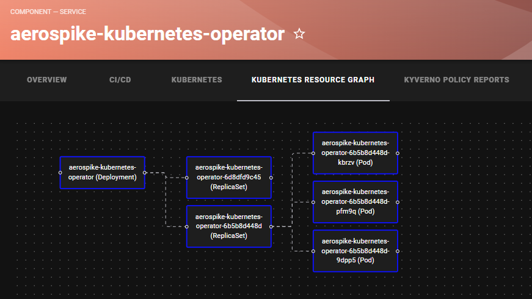
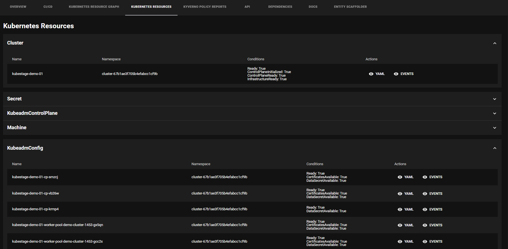

# kubernetes-resources

Welcome to the kubernetes-resources plugin!

[](https://www.npmjs.com/package/@terasky/backstage-plugin-kubernetes-resources-frontend)

## Description

The Kubernetes Resources plugin for Backstage provides a visual graph representation of Kubernetes resources and their dependencies within your clusters. It allows users to:

- Visualize relationships between Kubernetes resources in an interactive graph
- View detailed YAML manifests of each resource
- Monitor Kubernetes events related to specific resources
- Download and copy resource configurations
- Track dependencies between various Kubernetes objects

### Requirements
This plugin requires installing a deployment on your Kubernetes cluster which aggregates and exposes the needed data for the plugin to work. The deployment manifest and the applications source code can be [found here](https://github.com/TeraSky-OSS/kubernetes-dependency-tracker).
To simply get started you can run the following:
```bash
export INGRESS_HOST_NAME="k8s-dependency-tracker.example.com"
wget https://github.com/TeraSky-OSS/kubernetes-dependency-tracker/releases/download/0.1.0/kubernetes-manifest.yaml
sed -i "s/REPLACE_ME/${INGRESS_HOST_NAME}/g" kubernetes-manifest.yaml
kubectl apply -f kubernetes-manifest.yaml
```

The next thing you will need to do is configure the backstage app-config.yaml and specifically the proxy section.

For each cluster connected to your backstage you will need to add a proxy endpoint like bellow:

```yaml
proxy:
  '/kubernetes-resources/<CLUSTER NAME>':
      target: 'http://<THE INGRESS URL OF THE DEPLOYED APP>'
      changeOrigin: true
      headers:
        Authorization: 'Bearer <SAME TOKEN AS IS USED IN THE K8S PLUGIN CONFIGURATION>
```
The cluster name the proxy url must be the same as the name given to your cluster in the kubernetes plugin configuration.

The plugin also requires the annotations bellow on your catalog entities. If you are using the Kubernetes Ingestor plugin these annotations are already auto configured for you.
```yaml
annotations:
  terasky.backstage.io/kubernetes-resource-name: 'resource-name'
  terasky.backstage.io/kubernetes-resource-kind: 'ResourceKind'
  terasky.backstage.io/kubernetes-resource-api-version: 'group/version'
  terasky.backstage.io/kubernetes-resource-namespace: 'namespace' # Optional
  backstage.io/managed-by-origin-location: 'cluster-name'
```

## Installation
If you want to enable the permission framework for this plugin, you must also install the  Kubernetes Resources Permissions Backend, and configure it based on the [docs here](../kubernetes-resources-permissions-backend/README.md).

To install and configure the `kubernetes-resources` frontend plugin in your Backstage instance, follow these steps:

  * Add the package
  ```bash
  yarn --cwd packages/app add @terasky/backstage-plugin-kubernetes-resources-frontend
  ```
  * Add to Entity Page (packages/app/src/components/catalog/EntityPage.tsx)
  ```javascript
  import { KubernetesResourcesPage, KubernetesResourceGraph, isKubernetesResourcesAvailable } from '@terasky/backstage-plugin-kubernetes-resources-frontend';

  const serviceEntityPage = (
    <EntityLayout>
      ...

      <EntityLayout.Route path="/kubernetes-resource-page" if={isKubernetesResourcesAvailable} title="Kubernetes Resources">
        <KubernetesResourcesPage />
      </EntityLayout.Route>
      <EntityLayout.Route path="/kubernetes-resource-graph" if={isKubernetesResourcesAvailable} title="Kubernetes Resource Graph">
        <KubernetesResourceGraph />
      </EntityLayout.Route>

      ...
    </EntityLayout>
  );

  ```

## Configuration
* available config options:
```yaml
kubernetesResources:
  enablePermissions: true # Whether to enable permission checks for the kubernetes resources plugin.
  concurrency: 10 # How many concurrent requests to make against the Kubernetes API to fetch resources
```

## Usage
Once installed and configured, the kubernetes-resources plugin will provide components for visualizing Kubernetes resources in the Backstage UI.
You can add a graph view:


  
And you can also add a table view:

  
If you have integrated the permissions elements, the UI will render accordingly

  
## Contributing
Contributions are welcome! Please open an issue or submit a pull request on GitHub.

## License
This project is licensed under the Apache-2.0 License.