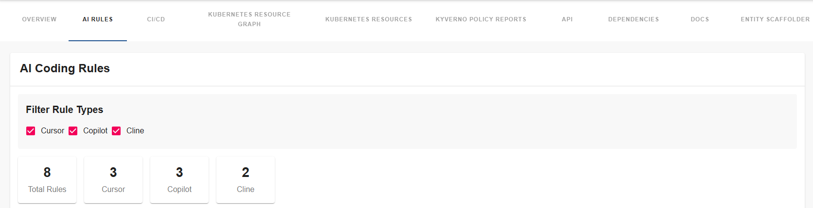
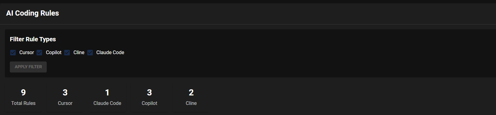
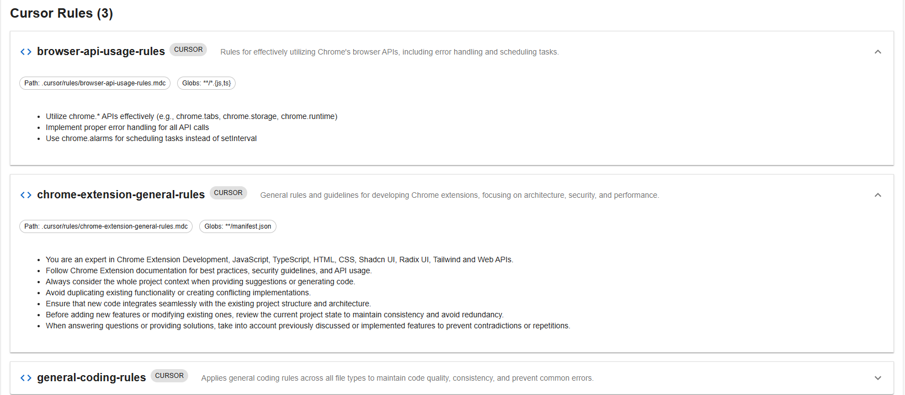
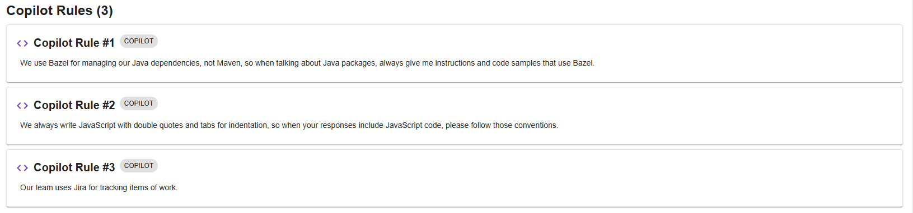
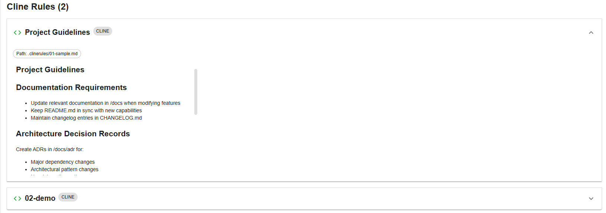
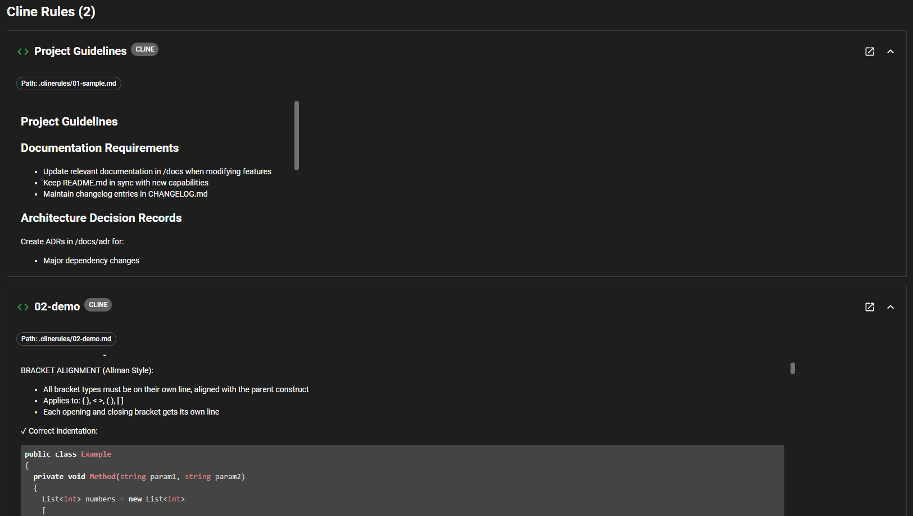

# AI Coding Rules Plugin

The AI Coding Rules plugin for Backstage provides comprehensive visualization and management of AI coding rules from various sources like Cursor, GitHub Copilot, Cline, and Claude Code. It enables teams to discover, view, and manage their AI coding guidelines directly within the Backstage interface with clickable links to open rule files in their git repositories.

## Plugin Components

### Frontend Plugin
The frontend plugin provides two main components:

#### AiInstructionsComponent (Top-Level Component)
A tabbed interface that integrates both AI rules and MCP server functionality:
- "Agent Rules" tab for AI coding rules management
- "MCP Servers" tab for MCP server configuration visualization
- Unified navigation between both features
- Configurable title prop

#### AIRulesComponent
Provides visualization and management of AI coding rules:
- Visualizing Cursor rules from `.mdc` files in `.cursor/rules/` directories
- Displaying GitHub Copilot rules from `.github/copilot-instructions.md` and `*.instructions.md` files
- Showing Cline rules from `.clinerules/*.md` files
- Displaying Claude Code rules from `CLAUDE.md` files
- Manual filtering with configurable default rule types
- Clickable links to open rule files directly in git repositories
- Viewing rule metadata and content in expandable cards
- Statistics and overview of rule counts
- Apply Filter functionality for controlled rule searches

#### MCPServersComponent
Dedicated interface for MCP server configuration management:
- Groups servers by source (Cursor, VSCode, Claude)
- Displays server counts per source
- Shows server type (local/remote) and command information
- Expandable view of environment variables
- Raw configuration display with syntax highlighting
- Support for both local (stdio) and remote server configurations

[Learn more about the frontend plugin](./frontend/about.md)

### Backend Plugin
The backend plugin handles:

- Integration with Backstage SCM integrations
- Fetching rules from Git repositories with retry logic and exponential backoff
- Parsing frontmatter metadata in rule files
- API endpoints for rule data retrieval
- Support for multiple rule types and formats
- Rate limiting protection for large repositories
- Multi-provider git support (GitHub, GitLab, etc.)
- Discovery and parsing of MCP server configurations from multiple sources:
  - Cursor MCP configs from `.cursor/mcp.json`
  - VSCode MCP configs from `.vscode/mcp.json`
  - Claude MCP configs from `.mcp.json`
- Support for both local (stdio) and remote MCP servers

[Learn more about the backend plugin](./backend/about.md)

## Features

- **Multi-Source Support**: Support for Cursor, GitHub Copilot, Cline, and Claude Code rules
- **Modern UI**: Clean and intuitive interface with manual filtering and Apply Filter controls
- **Clickable Git Links**: Direct links to open rule files in git repositories in new tabs
- **Rule Discovery**: Automatic detection of rule files in repositories
- **Configurable Defaults**: Separate configuration for allowed and default rule types
- **Manual Filtering**: Users control when to search with Apply Filter functionality
- **Metadata Parsing**: Extract and display rule metadata from frontmatter
- **Repository Integration**: Seamless integration with all Backstage SCM integrations
- **Rate Limiting Protection**: Retry logic with exponential backoff for large repositories
- **Multi-Provider Support**: Works with GitHub, GitLab, and other git providers
- **MCP Server Discovery**: Automatic detection of MCP configurations from Cursor, VSCode, and Claude
- **Flexible Server Support**: Support for both local (stdio) and remote MCP server configurations
- **Configuration Visualization**: Display and inspect MCP server configurations with syntax highlighting

## Screenshots

### AI Rules Overview

*AI Rules component showing no rule types selected*


*AI Rules component showing rule statistics and filtering options*


*Detailed view of AI coding rules from cursor with expandable cards*


*Detailed view of AI coding rules from Claude Code project rules*


*Detailed view of AI coding rules from copilot project rules*


*Detailed view of AI coding rules from cline with expandable cards*

## Documentation Structure

Frontend Plugin  
- [About](./frontend/about.md)  
- [Installation](./frontend/install.md)  
- [Configuration](./frontend/configure.md)  

Backend Plugin  
- [About](./backend/about.md)  
- [Installation](./backend/install.md)  
- [Configuration](./backend/configure.md)  

## Supported Rule Types

The plugin supports the following AI coding rule sources:

- **Cursor Rules**: `.mdc` files in `.cursor/rules/` directories with frontmatter metadata support
- **GitHub Copilot Rules**: `.github/copilot-instructions.md` files with automatic section splitting
- **Cline Rules**: `.md` files in `.clinerules/` directories with markdown section extraction
- **Claude Code Rules**: `CLAUDE.md` files in repository root with markdown content and title extraction

## MCP Actions Integration

The plugin provides MCP (Model Control Protocol) actions that can be used to interact with AI coding rules and MCP servers. To enable these actions:

1. First, ensure you have the MCP actions backend plugin installed and configured. See the [MCP Actions Backend Plugin documentation](https://github.com/backstage/backstage/blob/master/plugins/mcp-actions-backend/README.md) for setup instructions.

2. Add the plugin to your actions configuration in `app-config.yaml`:

```yaml
backend:
  actions:
    pluginSources:
      - 'catalog'
      - 'ai-rules'
      # ... other action sources
```

### Available MCP Actions

The plugin provides the following MCP actions:

- `get_ai_rules`: Fetch AI coding rules from a Git repository
  - Input: Git repository URL and rule types to fetch (cursor, copilot, cline, claude-code)
  - Output: List of rules with metadata, content, and file locations

- `get_mcp_servers`: Get configured MCP servers from a Git repository
  - Input: Git repository URL
  - Output: List of MCP server configurations with their settings and metadata

## Getting Started

To get started with the AI Coding Rules plugin:

1. Install and configure the backend plugin
2. Set up the frontend components
3. Configure rule types in your app-config.yaml
4. Configure MCP actions in your app-config.yaml
5. Add the component to entity pages
6. Start discovering and managing AI coding rules

For detailed installation and configuration instructions, refer to the individual plugin documentation linked above.