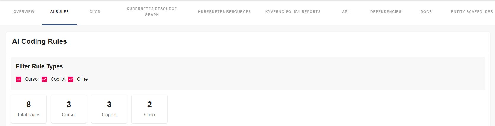
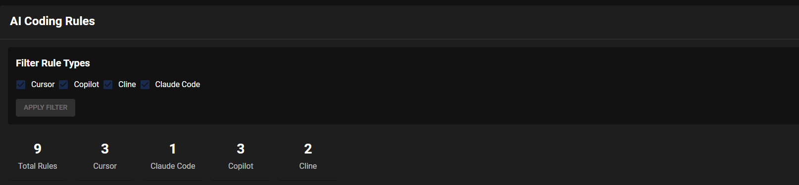
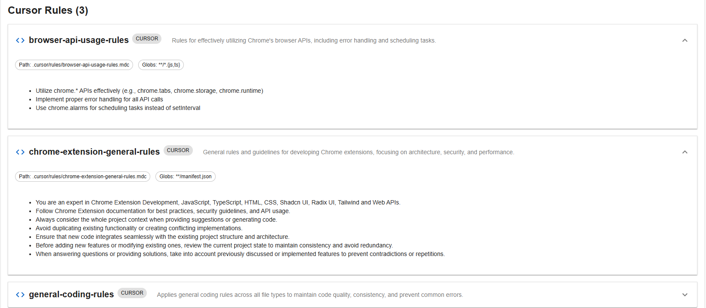
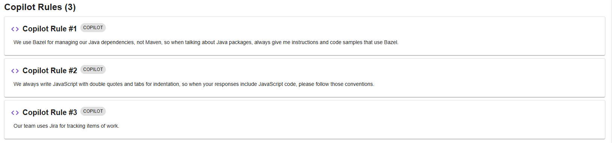
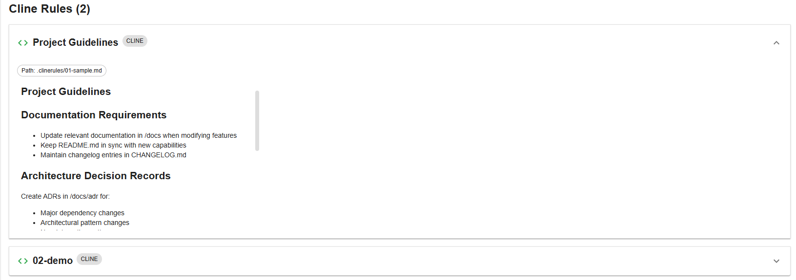
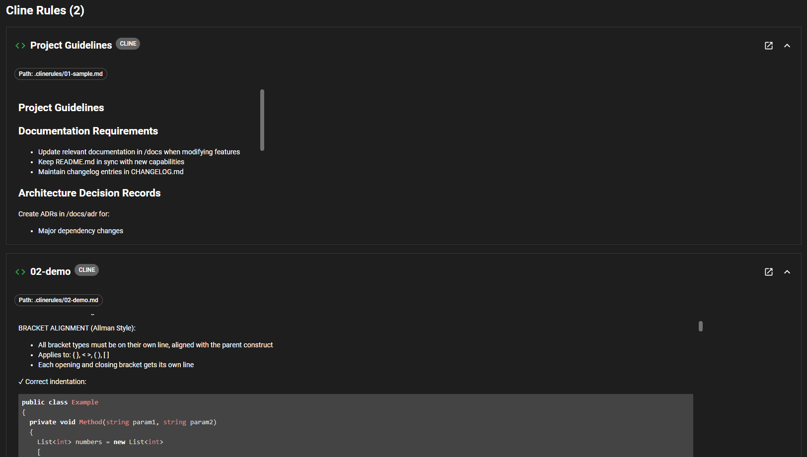

# AI Coding Rules Plugin

The AI Coding Rules plugin for Backstage provides comprehensive visualization and management of AI coding rules, agent skills, ignore files, and agent configurations from a wide range of AI coding assistants. It supports 11 agent types including Cursor, GitHub Copilot, Cline, Claude Code, Windsurf, Roo Code, OpenAI Codex, Gemini CLI, Amazon Q Developer, Continue, and Aider. Rules, MCP server configs, ignore files, agent configs, and Agent Skills (agentskills.io standard) are all discoverable directly within the Backstage interface with clickable links to open files in their git repositories.

## Plugin Components

### Frontend Plugin

The frontend plugin provides a unified tabbed interface (`AiInstructionsComponent`) with five tabs, plus standalone components for each capability:

#### AiInstructionsComponent (Top-Level Component)

A scrollable tabbed interface that integrates all AI context features:

| Tab | Component | Description |
|-----|-----------|-------------|
| **Agent Rules** | `AIRulesComponent` | Visualize and filter coding rules from 11 agent types |
| **MCP Servers** | `MCPServersComponent` | Inspect MCP server configurations from 5 sources |
| **Ignore Files** | `IgnoreFilesComponent` | View agent-specific ignore files |
| **Agent Configs** | `AgentConfigsComponent` | Inspect agent configuration files |
| **Agent Skills** | `AgentSkillsComponent` | Browse Agent Skills (agentskills.io standard) |

#### AIRulesComponent

Rules visualization and management supporting all 11 agent types:

- **Cursor**: `.cursorrules`, `.cursor/rules/*.mdc|.md`, `.cursor/MEMORY.md`
- **GitHub Copilot**: `.github/copilot-instructions.md`, `.github/instructions/*.instructions.md`
- **Cline**: `.clinerules` (root file), `.clinerules/*.md`
- **Claude Code**: `CLAUDE.md`, `.claude/CLAUDE.md`, `CLAUDE.local.md`, `.claude/rules/*.md`
- **Windsurf**: `.windsurfrules`, `.windsurf/rules/*.md`
- **Roo Code**: `.roorules`, `.roo/rules/`, `.roo/rules-code/`, `.roo/rules-architect/`, `.roo/rules-ask/`, `.roo/rules-debug/`
- **OpenAI Codex**: `AGENTS.md`, `AGENTS.override.md`
- **Gemini CLI**: `GEMINI.md`, `.gemini/*.md`
- **Amazon Q**: `.amazonq/rules/*.md`
- **Continue**: `.continue/rules/*.md`, `.continue/prompts/*.md`
- **Aider**: `CONVENTIONS.md`

UX features: content search bar, copy to clipboard, raw/rendered toggle per rule, export all rules to Markdown, manual filter with Apply Filter button.

#### MCPServersComponent

MCP server configuration visualization supporting 5 sources:

- `.cursor/mcp.json` (Cursor)
- `.vscode/mcp.json` (VSCode)
- `.mcp.json` (Claude)
- `.windsurf/mcp.json` (Windsurf)
- `.cline/mcp_settings.json` (Cline)

Groups servers by source, displays type (local/remote), command, environment variables, and raw JSON.

#### IgnoreFilesComponent

Displays agent-specific ignore files found in the repository:

- `.cursorignore` (Cursor)
- `.aiderignore` (Aider)
- `.rooignore` (Roo Code)
- `.geminiignore` (Gemini CLI)
- `.copilotignore` (Copilot)

Shows line-numbered content with syntax highlighting and a link to open the file in the repository.

#### AgentConfigsComponent

Displays agent configuration files with syntax highlighting:

- `.aider.conf.yml` (YAML)
- `.continue/config.yaml` or `.continue/config.json`
- `.cursor/settings.json`
- `.zed/assistant.json`

#### AgentSkillsComponent

Discovers and displays [Agent Skills](https://agentskills.io) — the open standard for portable, reusable AI capabilities:

- `.agents/skills/` (cross-client interoperability standard)
- `.claude/skills/` (Claude Code native location)
- `.cursor/skills/` (Cursor native location)

Each skill shows its name, description, compatibility, license, author/version metadata, full SKILL.md content, and an enumeration of bundled resource files (`scripts/`, `references/`, `assets/`).

[Learn more about the frontend plugin](./frontend/about.md)

### Backend Plugin

The backend plugin handles:

- Integration with Backstage SCM integrations
- Fetching rules from Git repositories with retry logic and exponential backoff
- Parsing frontmatter metadata in rule files
- REST API endpoints for all capabilities
- Support for 11 rule types and formats
- Rate limiting protection for large repositories
- Multi-provider git support (GitHub, GitLab, etc.)
- MCP server configuration discovery (5 sources)
- Agent ignore file discovery
- Agent configuration file discovery
- Agent Skills discovery (agentskills.io standard)

[Learn more about the backend plugin](./backend/about.md)

## Features

- **11 Agent Types**: Cursor, Copilot, Cline, Claude Code, Windsurf, Roo Code, OpenAI Codex, Gemini CLI, Amazon Q, Continue, Aider
- **Content Search**: Full-text search across all rule names, titles, and content
- **Copy to Clipboard**: One-click copy for any rule's content
- **Raw/Rendered Toggle**: Switch between rendered Markdown and raw source per rule
- **Export to Markdown**: Download all rules as a single `.md` file
- **Ignore Files Viewer**: Inspect agent-specific ignore patterns
- **Agent Configs Viewer**: Inspect agent configuration files with syntax highlighting
- **Agent Skills Support**: Full support for the [agentskills.io](https://agentskills.io) standard
- **5 MCP Sources**: Cursor, VSCode, Claude, Windsurf, Cline
- **Clickable Git Links**: Direct links to open rule/skill files in git repositories
- **Manual Filtering**: Users control when to search with Apply Filter functionality
- **Configurable Defaults**: Separate configuration for allowed and default rule types
- **Repository Integration**: Seamless integration with all Backstage SCM integrations
- **Rate Limiting Protection**: Retry logic with exponential backoff for large repositories

## Screenshots

### AI Rules Overview

*AI Rules component showing no rule types selected*


*AI Rules component showing rule statistics and filtering options*


*Detailed view of AI coding rules from Cursor with expandable cards*


*Detailed view of AI coding rules from Claude Code project rules*


*Detailed view of AI coding rules from Copilot project rules*


*Detailed view of AI coding rules from Cline with expandable cards*

## Documentation Structure

Frontend Plugin  
- [About](./frontend/about.md)  
- [Installation](./frontend/install.md)  
- [Configuration](./frontend/configure.md)  

Backend Plugin  
- [About](./backend/about.md)  
- [Installation](./backend/install.md)  
- [Configuration](./backend/configure.md)  

## Supported Rule Types

| Agent | Rule Type Value | Files Scanned |
|-------|----------------|---------------|
| Cursor | `cursor` | `.cursorrules`, `.cursor/rules/*.mdc\|.md`, `.cursor/MEMORY.md` |
| GitHub Copilot | `copilot` | `.github/copilot-instructions.md`, `.github/instructions/*.instructions.md` |
| Cline | `cline` | `.clinerules` (root file), `.clinerules/*.md` |
| Claude Code | `claude-code` | `CLAUDE.md`, `.claude/CLAUDE.md`, `CLAUDE.local.md`, `.claude/rules/*.md` |
| Windsurf | `windsurf` | `.windsurfrules`, `.windsurf/rules/*.md` |
| Roo Code | `roo-code` | `.roorules`, `.roo/rules/`, `.roo/rules-{mode}/` |
| OpenAI Codex | `codex` | `AGENTS.md`, `AGENTS.override.md` |
| Gemini CLI | `gemini` | `GEMINI.md`, `.gemini/*.md` |
| Amazon Q | `amazon-q` | `.amazonq/rules/*.md` |
| Continue | `continue` | `.continue/rules/*.md`, `.continue/prompts/*.md` |
| Aider | `aider` | `CONVENTIONS.md` |

## MCP Actions Integration

The plugin provides MCP (Model Control Protocol) actions that can be used by AI assistants to access rules and MCP servers. To enable these actions:

1. Ensure you have the MCP actions backend plugin installed and configured.

2. Add the plugin to your actions configuration in `app-config.yaml`:

```yaml
backend:
  actions:
    pluginSources:
      - 'catalog'
      - 'ai-rules'
```

### Available MCP Actions

- `get_ai_rules`: Fetch AI coding rules from a Git repository
  - Input: Git repository URL and rule types to fetch (all 11 supported types)
  - Output: List of rules with metadata, content, file locations, and type-specific fields

- `get_mcp_servers`: Get configured MCP servers from a Git repository
  - Input: Git repository URL
  - Output: List of MCP server configurations from all 5 supported sources

## Getting Started

1. Install and configure the backend plugin
2. Set up the frontend components
3. Configure rule types in your `app-config.yaml`
4. Configure MCP actions in your `app-config.yaml`
5. Add the component to entity pages
6. Start discovering and managing AI coding rules, skills, and configurations

For detailed installation and configuration instructions, refer to the individual plugin documentation linked above.
