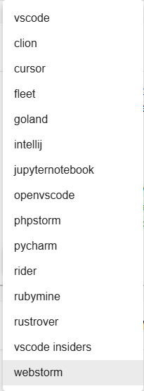

# DevPod Plugin

The DevPod plugin for Backstage provides seamless integration with DevPod workspaces, enabling developers to quickly launch their preferred development environments directly from the Backstage UI.

## Plugin Components

### Frontend Plugin
The frontend plugin adds a convenient "Open in DevPod" button to component overview pages, allowing users to:

- Launch DevPod workspaces with a single click
- Choose from multiple supported IDEs
- View equivalent CLI commands

[Learn more about the frontend plugin](./frontend/about.md)

## Documentation Structure
- [About](./frontend/about.md)
- [Installation](./frontend/install.md)
- [Configuration](./frontend/configure.md)

## Screenshots

### DevPod Integration

### IDE Selection

## Supported IDEs

The plugin supports a wide range of popular IDEs:

- Visual Studio Code (vscode)
- Visual Studio Code Insiders (vscode-insiders)
- JetBrains Suite:
    - IntelliJ IDEA (intellij)
    - PyCharm (pycharm)
    - WebStorm (webstorm)
    - GoLand (goland)
    - CLion (clion)
    - PhpStorm (phpstorm)
    - Rider (rider)
    - RubyMine (rubymine)
    - RustRover (rustrover)
    - Fleet (fleet)
- Cursor (cursor)
- OpenVSCode (openvscode)
- Jupyter Notebook (jupyternotebook)

## Getting Started

To get started with the DevPod plugin:

1. Install the plugin in your Backstage instance
2. Configure your default IDE preferences (optional)
3. Add the DevPod component to your entity pages

For detailed installation and configuration instructions, refer to:

- [About the plugin](./frontend/about.md)
- [Installation Guide](./frontend/install.md)
- [Configuration Guide](./frontend/configure.md)
