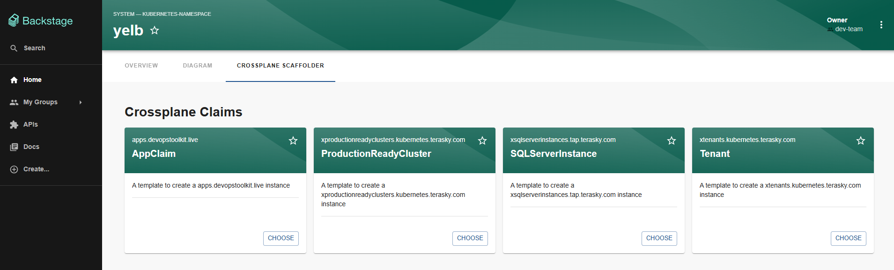
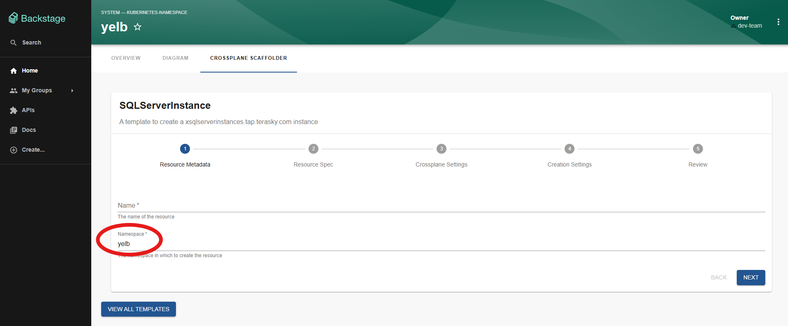

# Entity Scaffolder Content Plugin

The Entity Scaffolder Content plugin for Backstage enables you to embed scaffolder templates directly within entity pages. This integration contextualises templates based on the entity they're being accessed from, making template discovery and usage more intuitive.

## Features

- **Embedded Template Tab**: Add a dedicated tab for scaffolder templates on entity pages
- **Context-Aware Templates**: Filter and populate templates based on entity context
- **Dynamic Initial Values**: Pre-populate template form fields using entity data
- **Form Decorator Support**: Backstage [form decorators](https://backstage.io/docs/features/software-templates/experimental/#form-decorators) declared in a template's `spec.formDecorators` are automatically executed before scaffold submission — enabling use-cases such as enforcing GitHub OAuth to prevent self-approval of PRs
- **Automatic Field Extension Discovery**: In the new Backstage frontend system all `FormFieldBlueprint` extensions (e.g. `RepoUrlPicker`, `EntityPicker`) are discovered automatically — no manual wiring required
- **Task Progress Display**: After submission the plugin shows a step-by-step task progress view including logs and template outputs
- **Flexible Configuration**: Customise template filtering, data mapping, layouts, and card components
- **Seamless Integration**: Works with existing scaffolder templates and the standard Backstage scaffolder backend

## Plugin Components

### Frontend Plugin
The plugin provides frontend components for:

- Displaying templates within entity pages
- Filtering templates based on entity context
- Pre-populating template forms with entity data
- Running form decorators before task submission
- Showing task progress, logs, and outputs inline

[Learn more about the frontend plugin](./frontend/about.md)

## Screenshots

*Example of embedded scaffolder templates*

*Template form with pre-populated data*

## Documentation Structure
- [About](./frontend/about.md)
- [Installation](./frontend/install.md)
- [Configuration](./frontend/configure.md)

## Getting Started

To get started with the Entity Scaffolder Content plugin:

1. Install the frontend plugin
2. Configure entity page integration
3. Set up template filters and data mapping
4. (Optional) Register form decorators for pre-submission logic
5. Start using contextualised templates

For detailed installation and configuration instructions, refer to the frontend documentation linked above.
