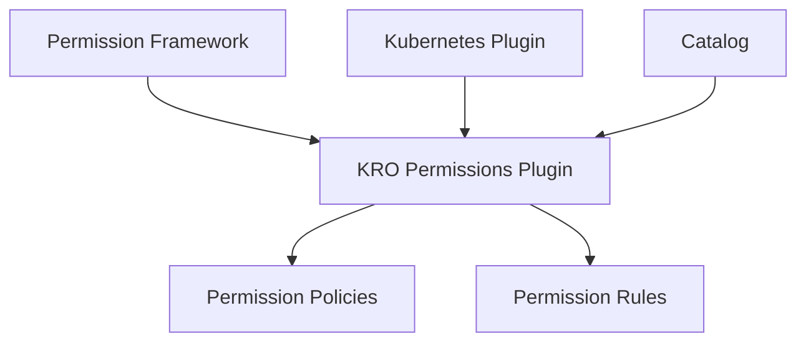

# KRO Resources Backend Plugin

The KRO Resources backend plugin (`@terasky/backstage-plugin-kro-resources-backend`) provides comprehensive functionality for managing KRO resources in your Backstage instance, including API integration, resource operations, and permission management.

## Features

- **Resource Management**:
  - Resource data retrieval and processing
  - Event monitoring and tracking
  - YAML configuration management
  - Resource relationship mapping
  - Resource graph generation

- **API Integration**:
  - Kubernetes cluster communication
  - Resource status monitoring
  - Event streaming
  - Resource operation execution

- **Permission Management**:
  - Pre-defined permissions for KRO resources
  - Granular control over resource access
  - Integration with Backstage's permission framework
  - Flexible policy configuration

- **MCP Actions**:
  - Resource data retrieval
  - Event monitoring
  - Resource graph generation
  - Resource operation execution

## Available Permissions

The plugin defines the following permissions:

### Instance Permissions
- `kro.instances.list`: Control access to listing KRO instances
- `kro.instances.view-yaml`: Control access to viewing instance YAML
- `kro.instances.show-events`: Control access to viewing instance events

### RGD Permissions
- `kro.rgds.list`: Control access to listing RGDs
- `kro.rgds.view-yaml`: Control access to viewing RGD YAML
- `kro.rgds.show-events`: Control access to viewing RGD events

### Resource Permissions
- `kro.resources.list`: Control access to listing managed resources
- `kro.resources.view-yaml`: Control access to viewing resource YAML
- `kro.resources.show-events`: Control access to viewing resource events

### View Permissions
- `kro.resource-graph.show`: Control access to resource graph visualization
- `kro.overview.view`: Control access to KRO overview information

All permissions are defined with the `read` action attribute.

## Integration Points

The plugin integrates with:

- Backstage permission framework
- Kubernetes backend plugin
- Catalog backend for entity information

## Architecture

The plugin follows Backstage's backend architecture:

