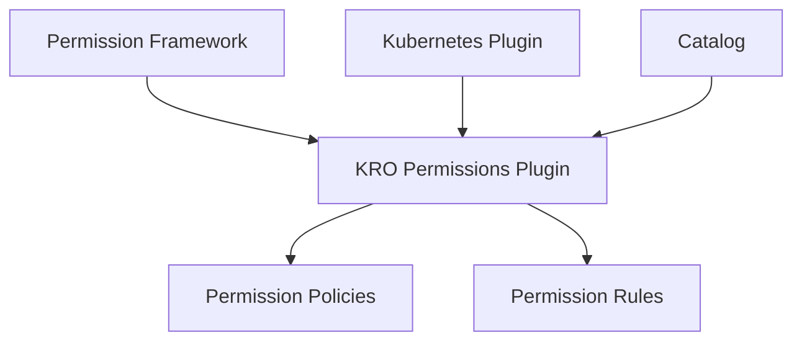

# KRO Permissions Backend Plugin

The KRO Permissions backend plugin provides permission management and access control for KRO resources in your Backstage instance.

## Features

- **Permission Definitions**: Pre-defined permissions for KRO resources
- **Access Control**: Granular control over KRO resource access
- **Integration**: Seamless integration with Backstage's permission framework
- **Policy Support**: Flexible policy configuration for different resource types

## Available Permissions

The plugin defines the following permissions:

### Instance Permissions
- `kro.instances.list`: Control access to listing KRO instances
- `kro.instances.view-yaml`: Control access to viewing instance YAML
- `kro.instances.show-events`: Control access to viewing instance events

### RGD Permissions
- `kro.rgds.list`: Control access to listing RGDs
- `kro.rgds.view-yaml`: Control access to viewing RGD YAML
- `kro.rgds.show-events`: Control access to viewing RGD events

### Resource Permissions
- `kro.resources.list`: Control access to listing managed resources
- `kro.resources.view-yaml`: Control access to viewing resource YAML
- `kro.resources.show-events`: Control access to viewing resource events

### View Permissions
- `kro.resource-graph.show`: Control access to resource graph visualization
- `kro.overview.view`: Control access to KRO overview information

All permissions are defined with the `read` action attribute.

## Integration Points

The plugin integrates with:

- Backstage permission framework
- Kubernetes backend plugin
- Catalog backend for entity information

## Architecture

The plugin follows Backstage's backend architecture:

