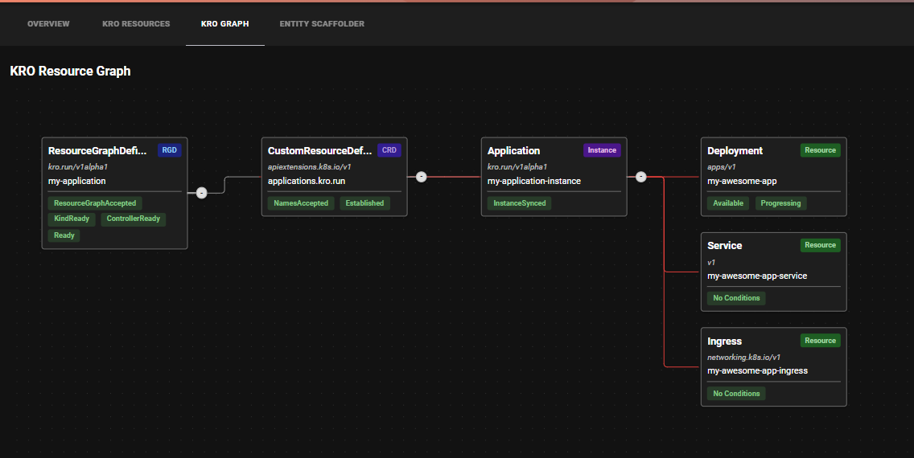
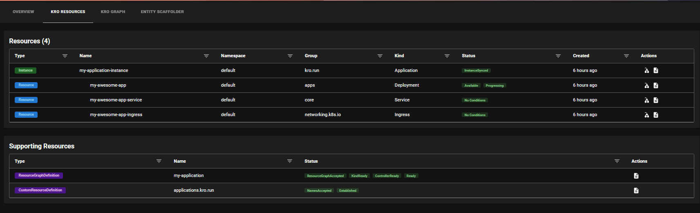
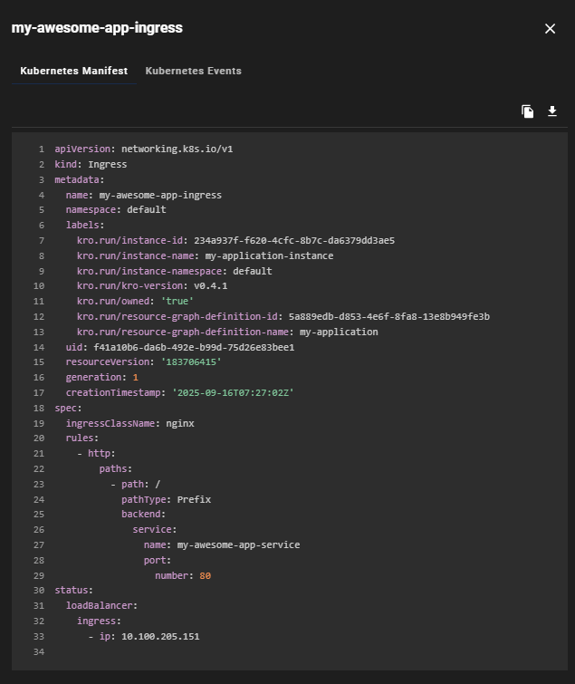
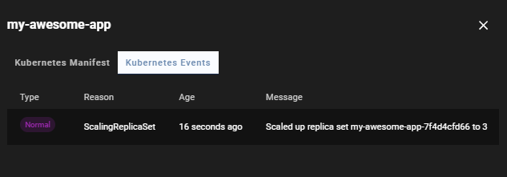
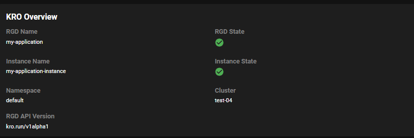

# KRO Resources Frontend Plugin

The KRO Resources frontend plugin (`@terasky/backstage-plugin-kro-resources-frontend`) provides a comprehensive UI for managing and visualizing KRO resources in your Backstage instance.

## Features

- **Resource Graph**: Interactive visualization of KRO resources and their relationships
- **Resource Table**: Detailed view of KRO instances and their managed resources
  - Resource status and health monitoring
  - Relationship tracking
  - Resource type filtering
  - Search and sort capabilities
- **YAML Management**: 
  - Access and inspect YAML configurations
  - Copy to clipboard functionality
  - Download YAML files
  - Syntax highlighting
- **Event Monitoring**: 
  - Track events for all KRO-related resources
  - Real-time event updates
  - Event filtering and search
  - Timestamp-based sorting
- **Overview Cards**: 
  - Quick status insights for KRO instances
  - Resource counts and statistics
  - Health status indicators
  - Quick action buttons

## Components

The plugin provides several React components:

- `KroOverviewCard`: Shows status and basic information about a KRO instance
  - Resource statistics
  - Health indicators
  - Quick actions
  - Status summaries
- `KroResourceGraph`: Interactive graph visualization of resource relationships
  - Zoomable interface
  - Node filtering
  - Relationship highlighting
  - Interactive node selection
- `KroResourceTable`: Detailed table view of resources
  - YAML and event access
  - Status indicators
  - Action buttons
  - Filtering capabilities
- `isKroAvailable`: Utility components for permission-based rendering
  - Conditional rendering
  - Permission checks
  - Feature flags support

## Integration Points

The plugin integrates with:

- KRO Resources backend plugin for:
  - Resource data retrieval
  - Event monitoring
  - YAML management
  - Resource operations
- Permission framework for:
  - Access control
  - Feature gating
  - Operation authorization
- Catalog for:
  - Entity information
  - Relationship mapping
  - Component discovery
- New Frontend System (Alpha) for:
  - Automatic route registration
  - Component integration
  - Extension points

## Screenshots

### Resource Graph

### Resource Table

### YAML Viewer

### Events View

### Overview Card

