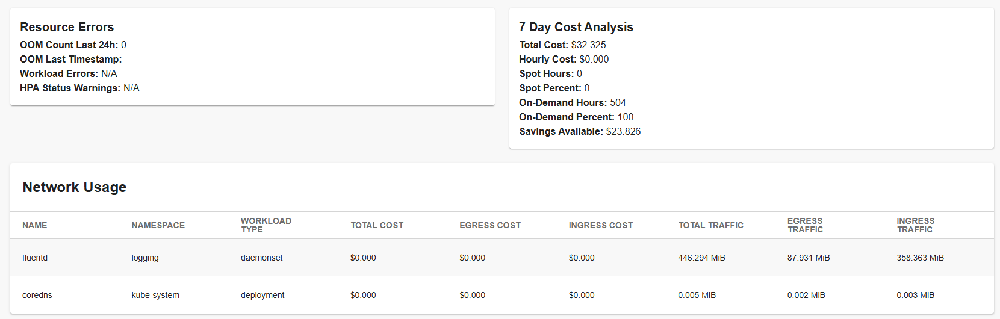

# ScaleOps Frontend Plugin

[](https://www.npmjs.com/package/@terasky/backstage-plugin-scaleops-frontend)

## Overview

The ScaleOps frontend plugin provides a comprehensive UI for viewing and analyzing cost optimization data from ScaleOps within your Backstage instance. It works with the ScaleOps backend plugin to display resource utilization, track potential savings, and access detailed cost analysis directly from your service catalog.

## Features

### Cost Optimization Dashboard
- Potential savings analysis
- Realized savings tracking
- Resource utilization metrics
- Cost breakdown views
- Multi-cluster visibility

### Resource Monitoring
- Resource usage tracking
- CPU and memory recommendations
- Optimization suggestions
- Performance metrics
- Workload details

### Integration Features
- ScaleOps dashboard links (when enabled)
- Automatic data fetching via backend plugin
- Multi-cluster support
- Real-time data updates
- Network usage analysis (when available)

## Components

### ScaleOpsDashboard
The main component that displays comprehensive workload data including:
- Cost optimization metrics
- Resource recommendations
- Savings analysis
- Workload configuration
- Policy information

Example usage:
```typescript
import { ScaleOpsDashboard, isScaleopsAvailable } from '@terasky/backstage-plugin-scaleops-frontend';

const entityPage = (
  <EntityLayout>
    <EntityLayout.Route 
      path="/scaleops" 
      if={isScaleopsAvailable}
      title="ScaleOps"
    >
      <ScaleOpsDashboard />
    </EntityLayout.Route>
  </EntityLayout>
);
```

### ScaleopsCard
A summary card component for the overview page:
```typescript
import { ScaleopsCard } from '@terasky/backstage-plugin-scaleops-frontend';

<Grid item md={6}>
  <ScaleopsCard />
</Grid>
```

## Technical Details

### Integration Points
- ScaleOps Backend Plugin (required)
- Entity catalog
- Backstage identity API

### Authentication
Authentication is handled entirely by the backend plugin - no frontend configuration needed.

### Data Flow
Frontend → Backend API (`/api/scaleops/api/*`) → ScaleOps Instance

## Use Cases

### Cost Optimization
1. Monitor resource costs per component
2. Identify savings opportunities
3. Track optimization progress
4. Analyze spending patterns

### Resource Management
1. View current vs recommended resources
2. Monitor over/under-provisioning
3. Track automation status
4. Plan capacity adjustments

### Team Collaboration
1. Share cost insights across teams
2. Track team-level improvements
3. Document optimization decisions
4. Monitor component health

## Prerequisites

**Required:**
- ScaleOps Backend Plugin must be installed and configured
- Entities must have `backstage.io/kubernetes-label-selector` annotation

## Screenshots

### Dashboard Overview

*Main dashboard showing workload details and cost optimization opportunities*

### Detailed Analysis

*Detailed view of resource configuration and recommendations*

For installation and configuration details, refer to the [Installation Guide](./install.md) and [Configuration Guide](./configure.md).
