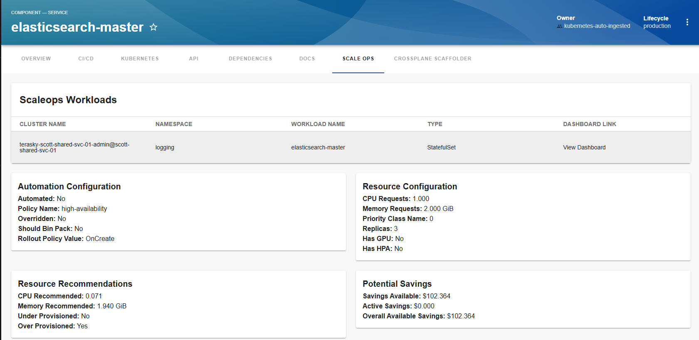
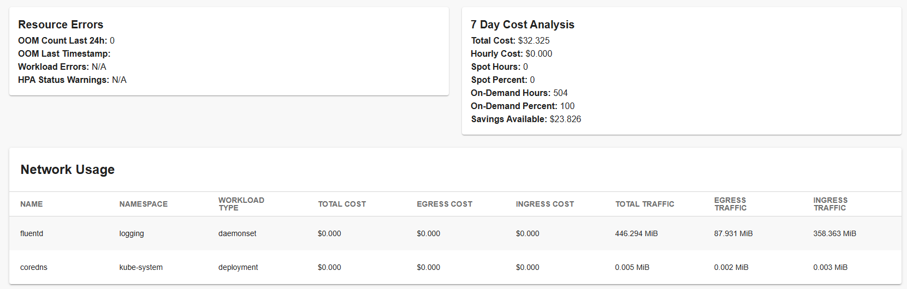

# ScaleOps Plugin

The ScaleOps plugin integrates ScaleOps cost optimization data into your Backstage instance, providing visibility into potential and realized savings for your Kubernetes resources. It offers a comprehensive dashboard view, direct links to the ScaleOps platform, and AI-powered automation through MCP actions.

## Features

- **Cost Optimization Insights**: View potential and realized savings
- **Multi-Cluster Support**: Monitor resources across clusters
- **Dashboard Integration**: Direct links to ScaleOps dashboard
- **AI Integration**: MCP actions for AI agents and automation tools
- **Secure Authentication**: Server-side authentication with token caching
- **Resource Monitoring**: Track Kubernetes resource usage
- **Cost Analysis**: Detailed cost breakdown views
- **Network Usage**: Intra-AZ and cross-AZ traffic analysis
- **Policy Management**: View and analyze ScaleOps policies

## Plugin Components

### Backend Plugin (Required)
The backend plugin provides:
- Secure server-side authentication with ScaleOps
- API proxying for frontend requests
- Token caching for optimal performance
- 5 entity-centric MCP actions for AI agents:
  - Workload data retrieval
  - Cost analysis
  - Optimization recommendations
  - Network usage analysis
  - Policy definitions

[Learn more about the backend plugin](./backend/about.md)

### Frontend Plugin
The frontend plugin provides UI components for:
- Cost visualization
- Resource monitoring
- Savings analysis
- Dashboard integration
- Workload details and metrics

[Learn more about the frontend plugin](./frontend/about.md)

## Screenshots

*ScaleOps dashboard overview showing cost optimization opportunities*

*Detailed view of resource utilization and savings*

## Documentation Structure

### Backend Plugin
- [About](./backend/about.md)
- [Installation](./backend/install.md)
- [Configuration](./backend/configure.md)

### Frontend Plugin
- [About](./frontend/about.md)
- [Installation](./frontend/install.md)
- [Configuration](./frontend/configure.md)

## Getting Started

To get started with the ScaleOps plugin:

1. **Install and configure the backend plugin** (required)
   - Handles authentication
   - Provides API proxying
   - Exposes MCP actions
2. **Install the frontend plugin** (optional, for UI)
   - Displays cost visualizations
   - Shows workload metrics
   - Links to ScaleOps dashboard
3. **Configure entity annotations**
   - Add `backstage.io/kubernetes-label-selector` to components
4. **Start using**
   - View cost data in UI
   - Use MCP actions with AI agents
   - Monitor and optimize costs

For detailed installation and configuration instructions, refer to the backend and frontend documentation linked above.
