# VCF Automation Plugins

The VCF Automation plugins provide comprehensive visibility and management capabilities for VMware Cloud Foundation (VCF) deployments within Backstage. It enables teams to monitor deployments, manage resources, and oversee project configurations through an intuitive interface.
The plugins support Aria Automation 8.x as well as VCF Automation 9.x, including both vm-apps (classic) and all-apps organization types.

## Features

- **Deployment Monitoring**: Track VCF deployment status and operations
- **Resource Management**: Manage vSphere VMs and other VCF resources including CCI Supervisor resources
- **Project Configuration**: Configure and monitor VCF projects across different organization types
- **CCI Support**: Full support for Cloud Consuption Interface (CCI) Supervisor namespaces and resources
- **Multi-Organization Type**: Support for both vm-apps (classic) and all-apps organization models in VCF 9
- **Permission Controls**: Fine-grained access control integration
- **Entity Integration**: Seamless catalog entity synchronization with proper entity relationships
- **Status Tracking**: Real-time deployment and resource status with live Kubernetes object monitoring
- **YAML Visualization**: Beautiful syntax-highlighted YAML rendering for Kubernetes manifests
- **YAML Editing**: Interactive YAML editing capabilities for CCI Supervisor resources with Monaco Editor

## Screenshots

### Project Overview
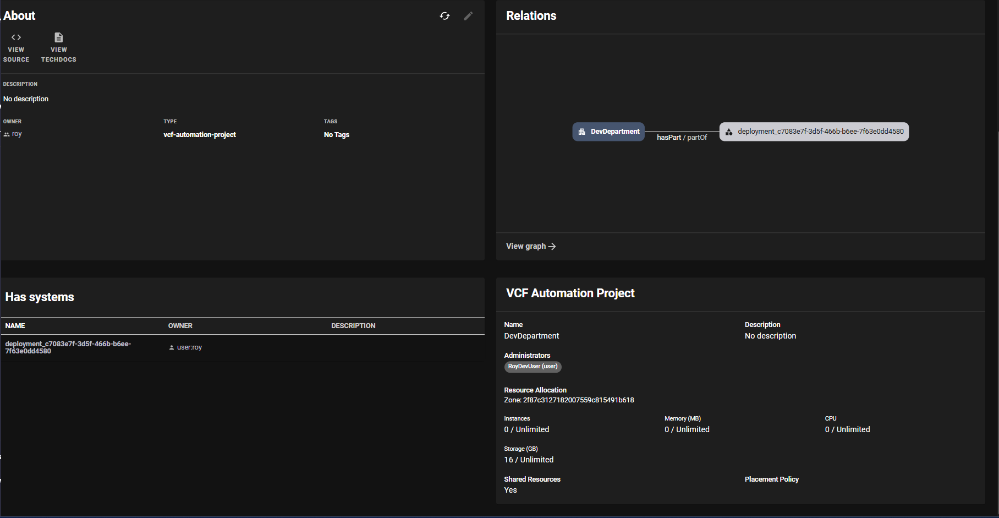

### Project Details


### Deployment Overview


### Deployment Details
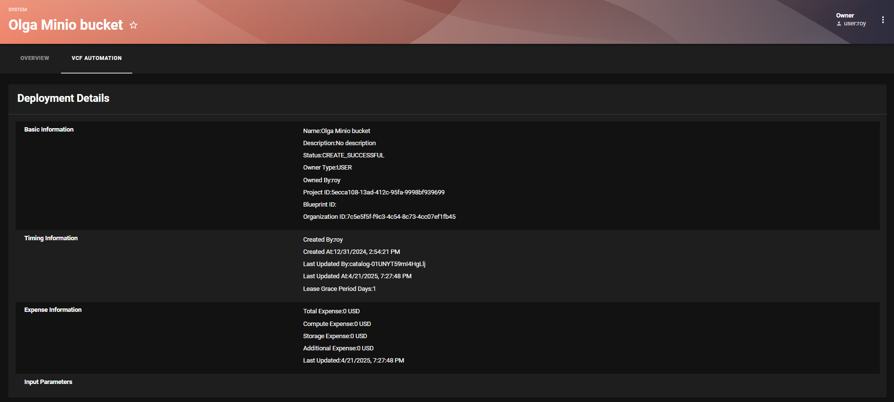


### vSphere VM Overview (VCFA 8 and VM Apps orgs in VCFA 9)
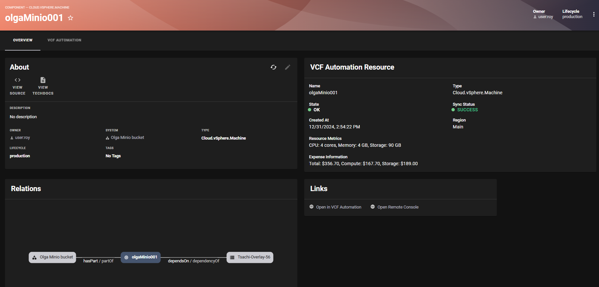

### vSphere VM Details (VCFA 8 and VM Apps orgs in VCFA 9)
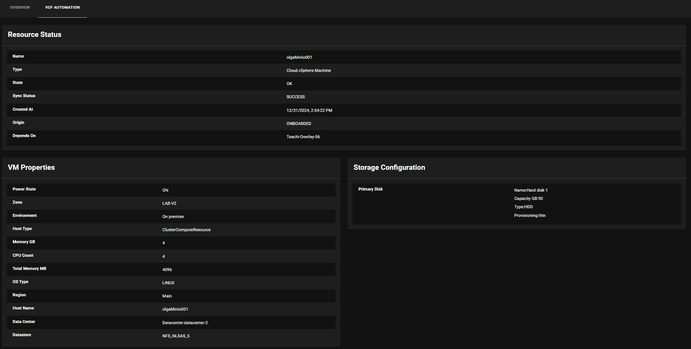


### Resource Overview (VCFA 8 and VM Apps orgs in VCFA 9)


### Resource Details (VCFA 8 and VM Apps orgs in VCFA 9)


### CCI Supervisor Namespace Overview (VCFA 9 All Apps Orgs)
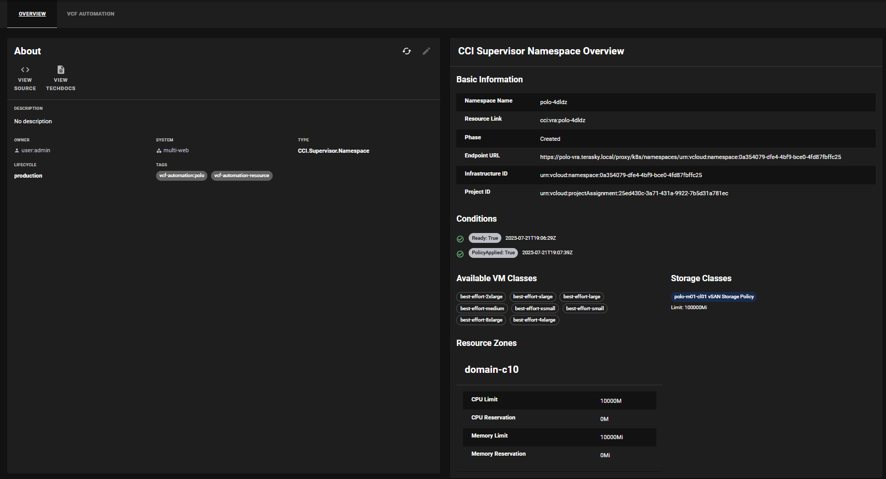

### CCI Supervisor Namespace Details (VCFA 9 All Apps Orgs)
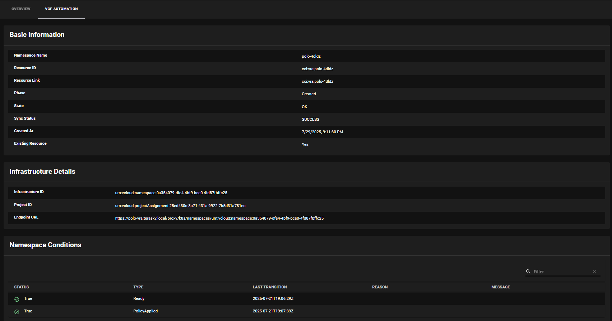
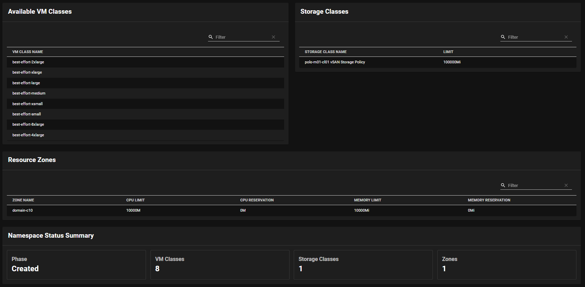

### CCI Supervisor Resource Overview (VCFA 9 All Apps Orgs)
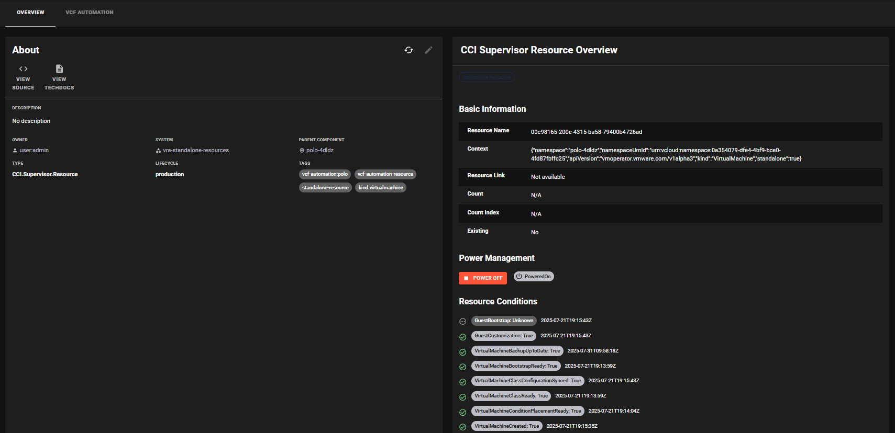
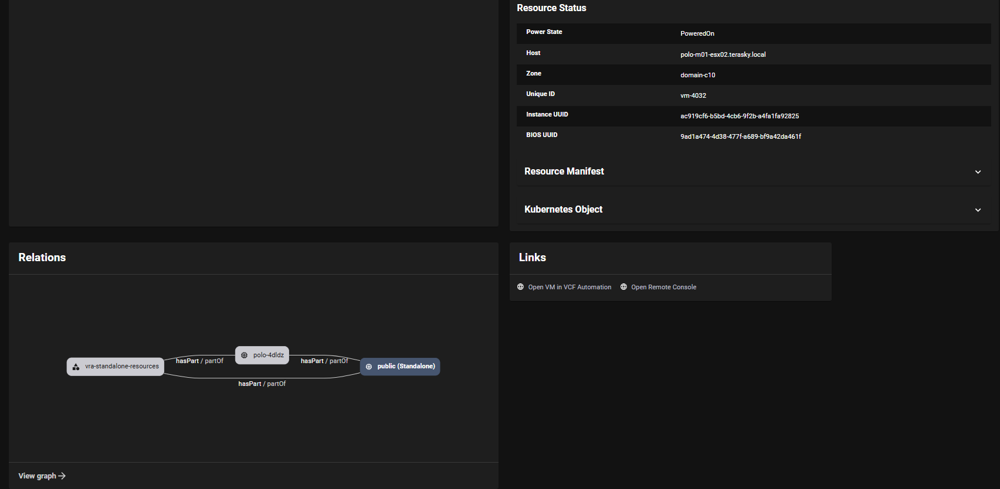

### CCI Supervisor Resource Details (VCFA 9 All Apps Orgs)
#### Basic Information
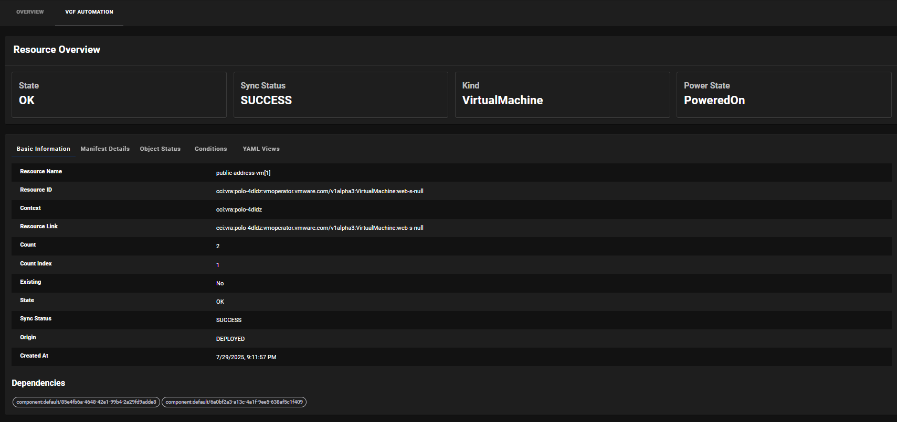
#### Manifest Details

#### Object Status
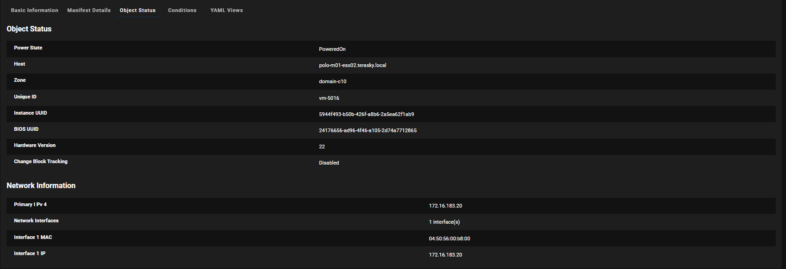
#### Resource Conditions

#### Defined Resource Manifest

#### Live Kubernetes Object Manifest


### CCI Supervisor Resource YAML Editing (VCFA 9 All Apps Orgs)
The VCF Automation plugin provides powerful YAML editing capabilities for CCI Supervisor resources, allowing users to directly modify Kubernetes resource manifests through a professional Monaco Editor interface.

#### Edit Resource Manifest Button (Overview Page)
For CCI resources (both standalone and deployment-managed) with proper permissions, an "Edit Resource Manifest" button appears in the resource overview page, providing quick access to the YAML editor modal.

#### YAML Editor Modal (Overview Page)

The modal includes:
- **Monaco Editor**: Professional code editor with YAML syntax highlighting
- **Real-time Validation**: Live YAML syntax validation with error feedback
- **Fixed Status Bar**: Validation status remains visible at the bottom
- **Save Confirmation**: Confirmation dialog before applying changes

#### Edit Manifest Tab (Details Page)  

The dedicated "Edit Manifest" tab provides:
- **Integrated Editor**: Monaco Editor embedded directly in the details page
- **Auto-loading**: Manifest automatically loads when tab is selected
- **Full-height Editor**: Optimized for comfortable editing experience
- **Inline Actions**: Save and Cancel buttons within the tab interface

## Plugin Components

### Frontend Plugin
The plugin provides frontend components for:  
- Deployment visualization  
- Resource management  
- Project configuration  
- Status monitoring  

[Learn more about the frontend plugin](./frontend/about.md)

### Backend Plugin
The plugin provides a backend deployment that:  
- Handles API integration  
- Manages permissions  
- Processes operations  
- Tracks resources  

[Learn more about the backend plugin](./backend/about.md)

### Ingestor Plugin
The plugin provides a backend that:  
- Discovers entities in your VCF Automation environment  
- Generates the relevant Backstage entities to represent the VCF Automation resources  
- Adds required metadata to the generated entities to allow the frontend plugin to pull runtime data  
- Adds, updates and deletes the entities in the Backstage catalog based on the current state in VCF Automation
  
[Learn more about the ingestor plugin](./ingestor/about.md)
  
## Available Components

### Deployment Components
- `VCFAutomationDeploymentOverview`: High-level deployment status
- `VCFAutomationDeploymentDetails`: Detailed deployment information

### VM Components
- `VCFAutomationVSphereVMOverview`: VM status overview
- `VCFAutomationVSphereVMDetails`: Detailed VM configuration

### Resource Components
- `VCFAutomationGenericResourceOverview`: Resource status
- `VCFAutomationGenericResourceDetails`: Resource configuration

### Project Components
- `VCFAutomationProjectOverview`: Project status overview (supports both vm-apps and all-apps)
- `VCFAutomationProjectDetails`: Project configuration details (supports both vm-apps and all-apps)

### CCI Components (New)
- `VCFAutomationCCINamespaceOverview`: CCI Supervisor Namespace overview with VM classes, storage classes, and zones
- `VCFAutomationCCINamespaceDetails`: Detailed CCI Supervisor Namespace information with status tables
- `VCFAutomationCCIResourceOverview`: CCI Supervisor Resource overview with manifest and object data, including YAML editing modal
- `VCFAutomationCCIResourceDetails`: Detailed CCI Supervisor Resource with tabbed views, YAML rendering, and integrated YAML editor tab

### Entity Types Created

The ingestor creates the following Backstage entity types:

- **Domain**: VCF Projects (with project-specific external links)
- **System**: VCF Deployments (with deployment-specific external links)
- **Component**: 
  - vSphere Virtual Machines (Cloud.vSphere.Machine)
  - CCI Supervisor Namespaces (CCI.Supervisor.Namespace)
  - CCI Supervisor Resources (CCI.Supervisor.Resource)
- **Resource**: Other VCF resources (generic resources)

### Entity Relationships

- **CCI Supervisor Resources** are marked as `subcomponentOf` their parent CCI Supervisor Namespace
- **Deployments** belong to their parent Project domain
- **Resources** are part of their parent Deployment system
- **Dependencies** are properly tracked between resources using `dependsOn` relationships


## Prerequisites

Before getting started, ensure you have:

1. VCF Automation Backend Plugin installed
2. VCF Ingestor Plugin configured
3. Access to VCF deployments
4. Proper permissions setup

## MCP Actions Integration

The VCF Automation plugin provides MCP (Model Control Protocol) actions for interacting with VCF Automation resources. To enable these actions:

1. First, ensure you have the MCP actions backend plugin installed and configured. See the [MCP Actions Backend Plugin documentation](https://github.com/backstage/backstage/blob/master/plugins/mcp-actions-backend/README.md) for setup instructions.

2. Add the plugin to your actions configuration in `app-config.yaml`:

```yaml
backend:
  actions:
    pluginSources:
      - 'catalog'
      - 'vcf-automation'
      # ... other action sources
```

### Available MCP Actions

The plugin provides the following MCP actions:

- `get_vcf_automation_instances`: Get configured VCF Automation instances
  - Input: None
  - Output: List of VCFA instances with their configurations

- `get_vcf_automation_projects`: List projects in a VCF Automation instance
  - Input: Optional instance name
  - Output: List of projects with IDs and names

- `get_vcf_automation_project_details`: Get detailed project information
  - Input: Project ID and optional instance name
  - Output: Full project details

- `get_supervisor_namespaces_from_vcf_automation`: List supervisor namespaces
  - Input: Optional instance name
  - Output: List of supervisor namespaces

- `get_supervisor_namespace_from_vcf_automation`: Get namespace details
  - Input: Namespace ID and optional instance name
  - Output: Full namespace details

- `get_vcf_automation_deployments`: List all deployments
  - Input: Optional instance name
  - Output: List of deployments

- `get_vcf_automation_deployment_details`: Get deployment details
  - Input: Deployment ID and optional instance name
  - Output: Deployment details, history, events, and resources

- `vm_power_action_from_vcf_automation`: Execute VM power actions
  - Input: Action type, VM details, and optional instance name
  - Output: Operation status and details

- `get_resource_details_from_vcf_automation`: Get resource details
  - Input: Deployment ID, resource ID, and optional instance name
  - Output: Full resource details

- `get_supervisor_resources_from_vcf_automation`: List supervisor resources
  - Input: Optional instance name
  - Output: List of supervisor resources

- `get_supervisor_resource_from_vcf_automation`: Get supervisor resource details
  - Input: Resource ID and optional instance name
  - Output: Full resource details

- `get_vcf_automation_supervisor_resource_manifest`: Get resource manifest
  - Input: Resource details and optional instance name
  - Output: Resource manifest

- `update_vcf_automation_supervisor_resource_manifest`: Update resource manifest
  - Input: Resource details, new manifest, and optional instance name
  - Output: Updated manifest and operation status

## Getting Started

To get started with the VCF Automation plugin:

1. Install frontend and backend plugins
2. Configure API integration
3. Set up entity synchronization
4. Configure permissions
5. Configure MCP actions in your app-config.yaml
6. Add components to entity pages

For detailed installation and configuration instructions, refer to the frontend and backend documentation linked above.
